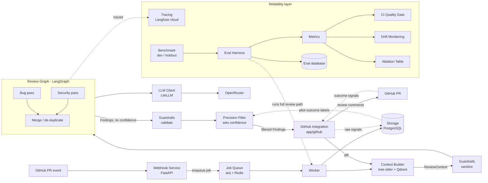

# Architecture Overview

Two halves: the **review path** (reviews PRs) and the **reliability layer** (measures and protects review quality).

**Review path:** [[Webhook Service]] → [[Job Queue]] → [[Context Builder]] → [[Guardrails]] (sanitize) → [[Review Graph]] → [[Guardrails]] (validate) → [[Precision Filter]] → [[GitHub Integration]] (post comments). [[Finding Schema]] is the data contract between them. [[LLM Client]] and [[Storage]] support the path.

**Reliability layer:** [[Tracing]], [[Benchmark]], [[Eval Harness]], [[Metrics]], [[CI Quality Gate]], [[Drift Monitoring]], [[Ablation Table]].

**Deferred to post-v1:** [[Operational Monitoring]] (Prometheus + Grafana).
