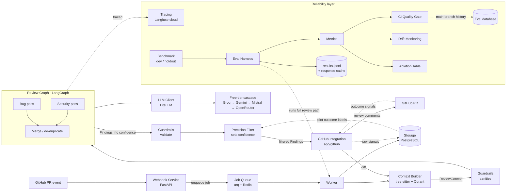

# Architecture Overview

Two halves: the **review path** (reviews PRs) and the **reliability layer** (measures and protects review quality).

**Review path:** [[Webhook Service]] → [[Job Queue]] → [[Context Builder]] → [[Guardrails]] (sanitize) → [[Review Graph]] → [[Guardrails]] (validate) → [[Precision Filter]] → [[GitHub Integration]] (post comments). [[Finding Schema]] is the data contract between them. [[LLM Client]] and [[Storage]] support the path.

**Reliability layer:** [[Tracing]], [[Benchmark]], [[Eval Harness]], [[Metrics]], [[CI Quality Gate]], [[Drift Monitoring]], [[Ablation Table]].

**Deferred to post-v1:** [[Operational Monitoring]] (Prometheus + Grafana).

## Built so far (M1–M2) versus planned
The diagram is the target design. What runs today (details in `docs/flow.md`):

[[Webhook Service]] → [[Job Queue]] worker → [[GitHub Integration]] (installation token, diff fetch) → [[Review Graph]] as a single baseline pass over the raw diff → [[GitHub Integration]] (post review) → [[Storage]] (`review_runs` row). [[LLM Client]] (four-provider cascade), [[Finding Schema]] (`Finding`, `ReviewResult`) and [[Tracing]] are built.

| Part | State |
|---|---|
| Webhook Service, LLM Client | built |
| Job Queue, GitHub Integration, Finding Schema, Storage, Tracing | built for the M2 path; later parts planned |
| Review Graph | baseline pass built; LangGraph bug and security passes planned |
| Context Builder, Guardrails, Precision Filter | planned |
| Outcome signals (dotted lines) | planned |
| Benchmark | in progress (M3) |
| Eval Harness, Metrics, CI Quality Gate eval job, Drift Monitoring, Ablation Table | planned; `ci.yml` (lint, types, tests, vault check) runs today |
