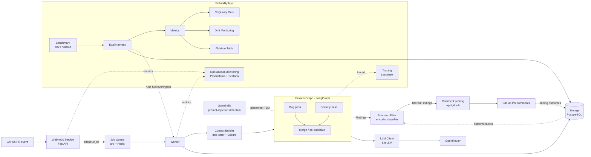

# Architecture Overview

Two halves: the **review path** (reviews PRs) and the **reliability layer** (measures and protects review quality).

**Review path components:** [[Webhook Service]] → [[Job Queue]] → [[Context Builder]] → [[Review Graph]] → [[Precision Filter]] → comment posting. [[Finding Schema]] is the data contract between them. [[Guardrails]], [[LLM Client]], and [[Storage]] support the path.

**Reliability layer:** [[Tracing]], [[Operational Monitoring]], [[Benchmark]], [[Eval Harness]], [[Metrics]], [[CI Quality Gate]], [[Drift Monitoring]], [[Ablation Table]].

Where Guardrails runs and which component owns comment posting are not specified. See [[Open Questions]].
